

StandardSeriesDemo
==================

This sample is combining [TeeChart for FireMonkey Component library](https://www.steema.com/product/vcl) with [FireMonkey](https://www.embarcadero.com/products/rad-studio/fm-application-platform). 
It contains several content pages which make use of the Chart component. 

Several layouts have been used in order to create DashBoard pages and show different standard series types in each one.

You can also read an article which has been dedicated to this example project ported to all the the TeeChart versions [here](https://www.steema.com/wp/blog/2015/06/18/check-out-the-new-standardseriesdemo-example/).

<table width="720" border="0" cellpadding="5">

<tr>

<td align="center" valign="center">
<a href="img src=Screenshots/image1.png"> 
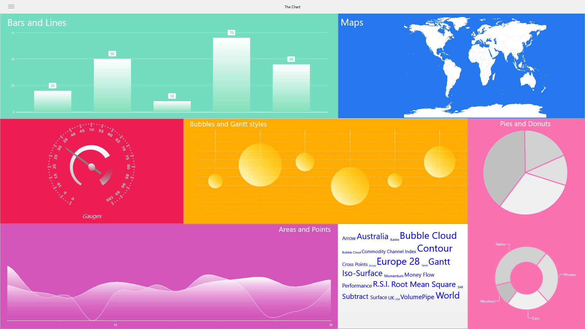
</a>
 
StandardSeries Dashboard.
</td>

<td align="center" valign="center">
<a href="img src=Screenshots/image2.png"> 
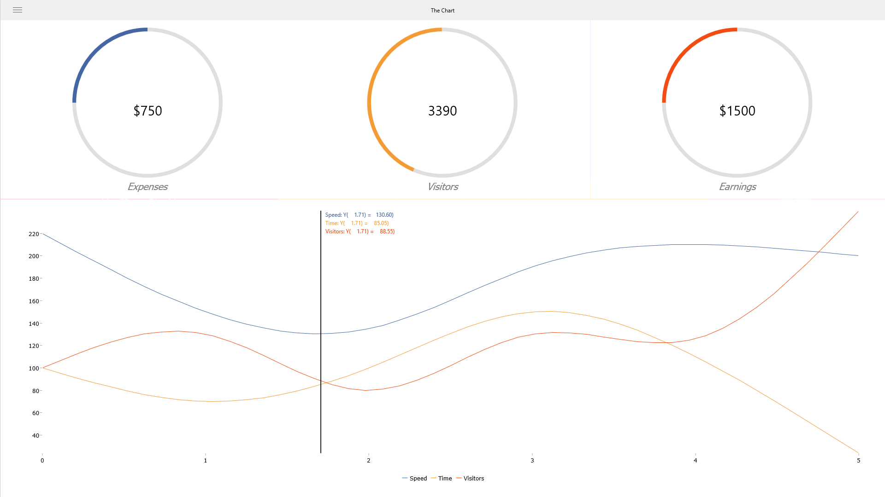
</a>
 
Donut & Line.
</td>

<td align="center" valign="center">
<a href="Screenshots/image3.png"> 
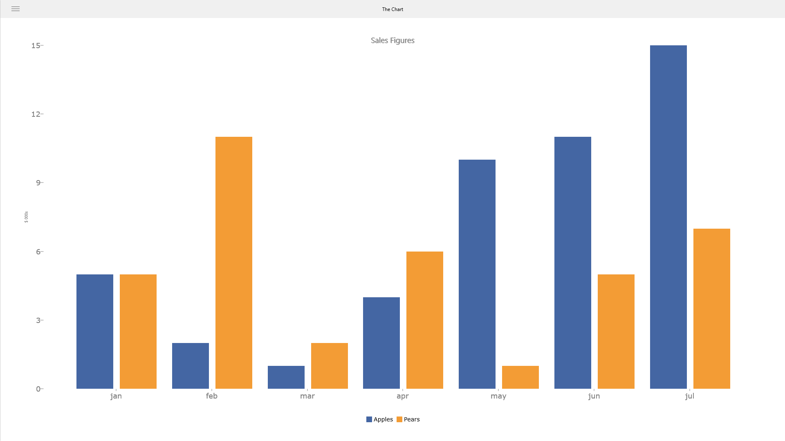
</a>
 
BarSeries.
</td>

<td align="center" valign="center">
<a href="Screenshots/image4.png"> 
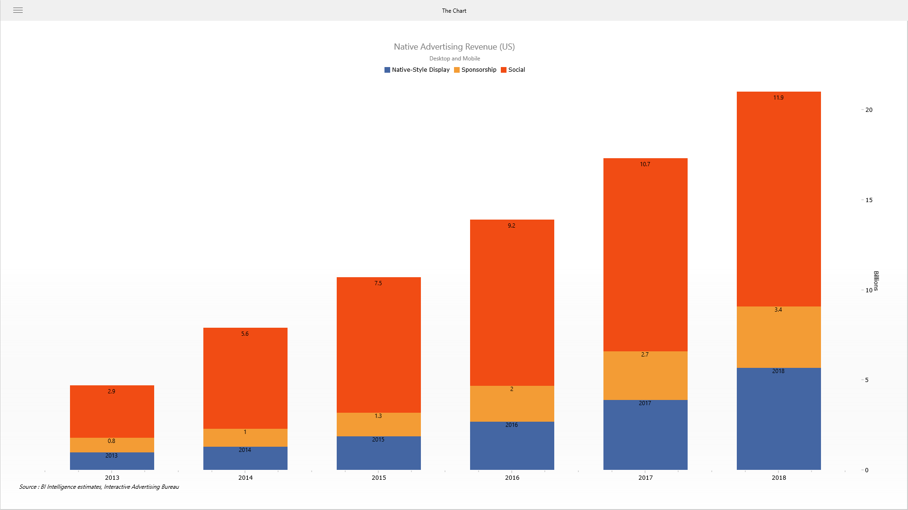
</a>
 
BarSeries Stacked.
</td>

<td align="center" valign="center">
<a href="Screenshots/image5.png"> 
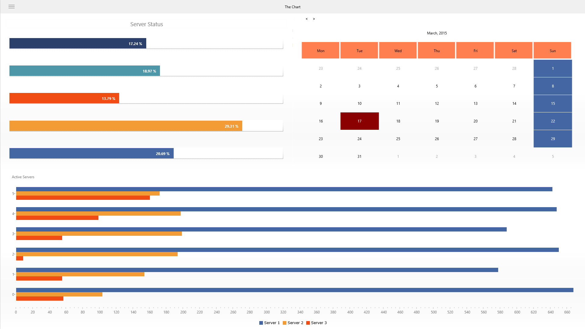</a>
 
Histogram & Calendar.
</td>

<td align="center" valign="center">
<a href="Screenshots/image6.png"> 
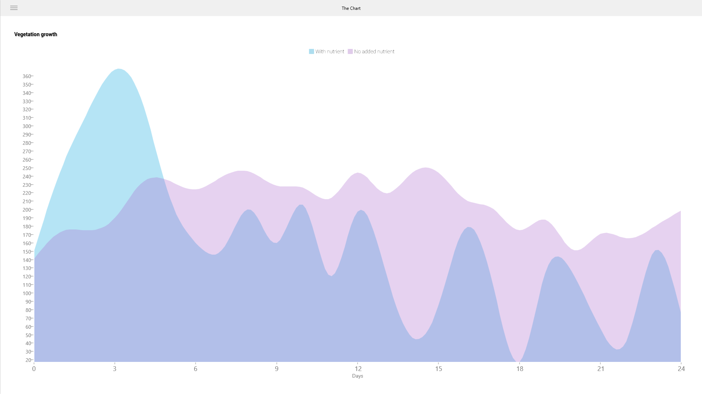
</a>
 
AreaSeries.
</td>

</tr>

<tr>

<td align="center" valign="center">
<a href="Screenshots/image7.png"> 
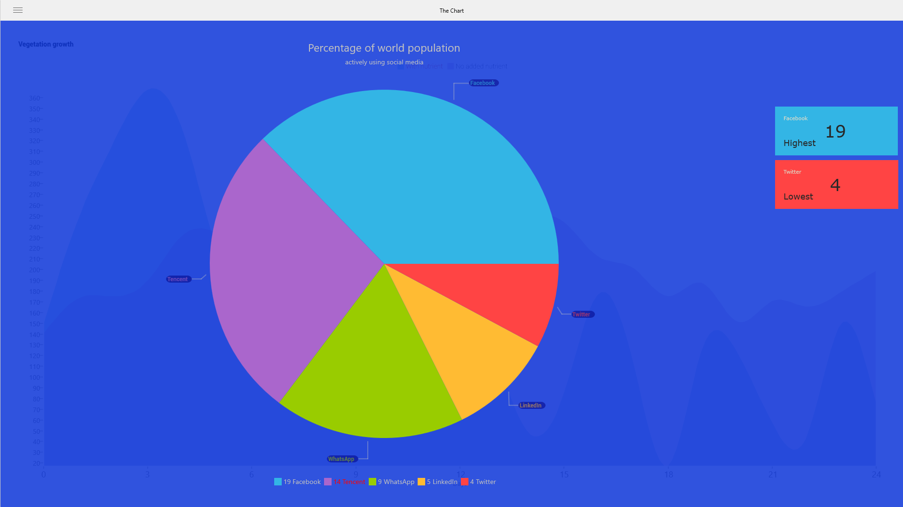
</a>
 
PieSeries.
</td>

<td align="center" valign="center">
<a href="Screenshots/image8.png"> 
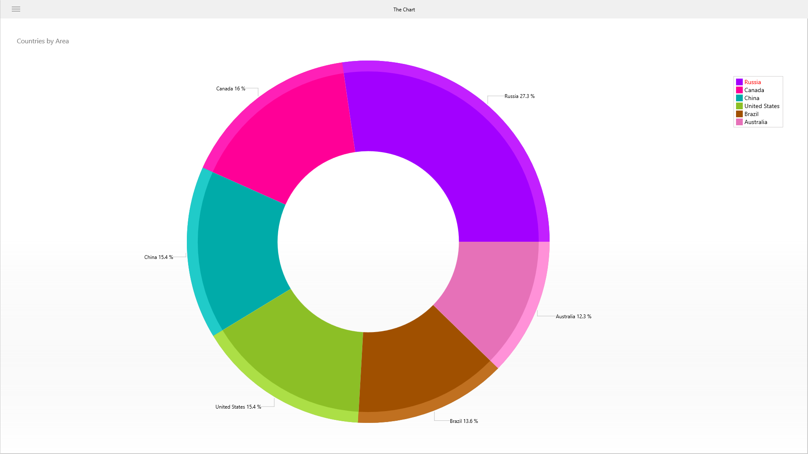
</a>
 
DonutSeries.
</td>

<td align="center" valign="center">
<a href="Screenshots/image9.png"> 
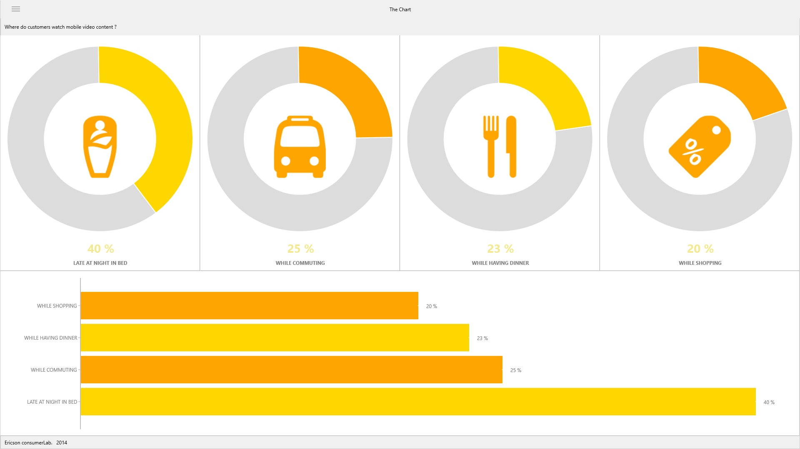
</a>
 
Donut & Histogram.
</td>

<td align="center" valign="center">
<a href="Screenshots/image10.png"> 
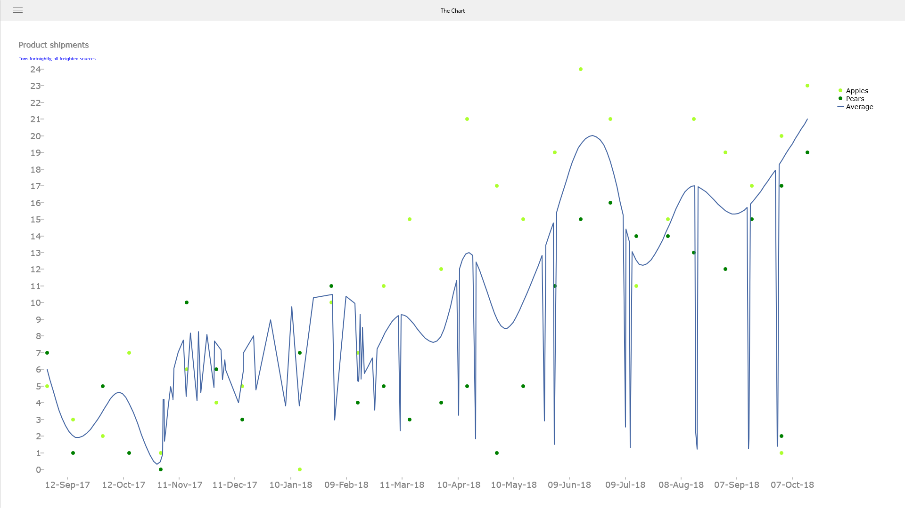
</a>
 
LineSeries.
</td>

<td align="center" valign="center">
<a href="Screenshots/image11.png"> 
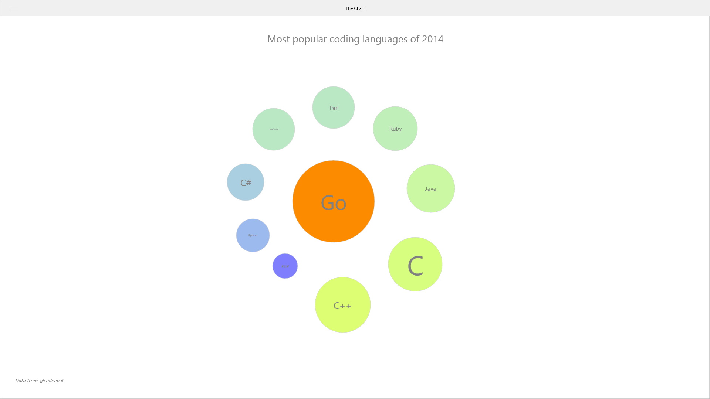
</a>
 
BubbleSeries.
</td>

<td align="center" valign="center">
<a href="Screenshots/image12.png"> 
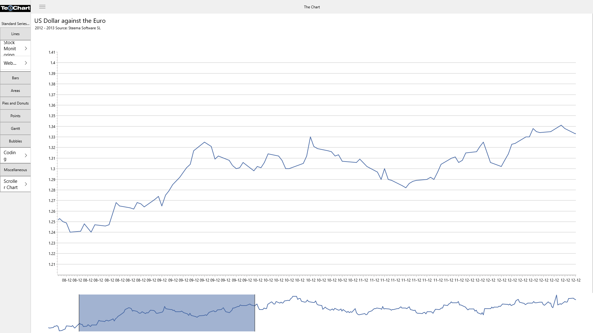
</a>
 
LineSeries.
</td>

</tr>

</table>

## Sample Requirements

You'll need TeeChart VCL/FMX evaluation or registered version to run the example on this repository. Fully functional evaluation version can be obtained at https://www.steema.com/downloads/vcl

---
### Author
------
Josep Lluis Jorge
@joseplluisjorge
